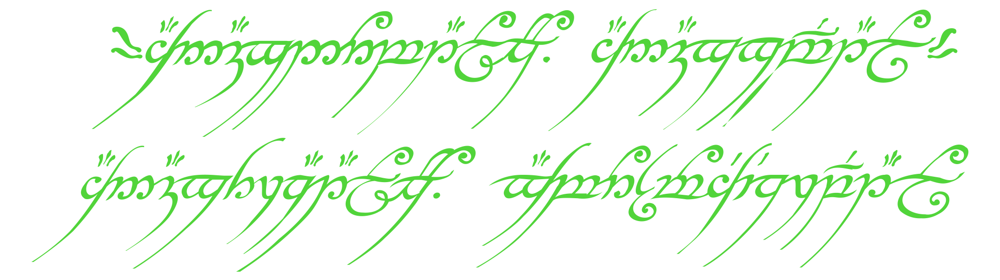

<!-- Custom SVG Header -->

  

# Pietro Quintavalle

  <b>Economics Student & IT Consultant · Switzerland 🇨🇭</b>

---

## About Me

> Hi! I'm Pietro, an IT Support–certified Economics student (USI, Lugano) with 5+ years' experience in system administration, virtualization, and network infrastructure.  
> 
> I engineer robust, secure, and scalable solutions—delivering production-grade servers (90%+ uptime) and infrastructure for clients and personal projects.  
> 
> Skilled in automation, scripting, and cross-platform deployments (Linux/Windows). I specialize in virtualization (Proxmox, Hyper-V), containerization (Docker, LXC), and Infrastructure as Code (IaC).
> 
> Currently, I'm passionate about bridging the gap between economics and technology through data analytics, machine learning, and modern web development (React/Next.js).
> 
> - 🎓 BSc in Economics (in progress)  
> - 🥇 Google IT Support & Data Analytics Certified  
> - 🌍 Trilingual: Italian (Native), English (Fluent), German (Conversational)
> - 🏠 Based in Switzerland

---

## 🛠️ Tech Stack

**System & Infrastructure:**  

**Networking & Security:**  

**Development:**  

**Data & Monitoring:**  

**Dev Tools:**  

---

## 📜 Certifications

- Google Data Analytics Professional Certificate
- Google IT Support Professional Certificate

---

## GitHub Stats

  
  

---

## 🌐 Connect

---

  Built with ❄️ using a Nord-inspired monochrome palette • Pietro Quintavalle © 2025

